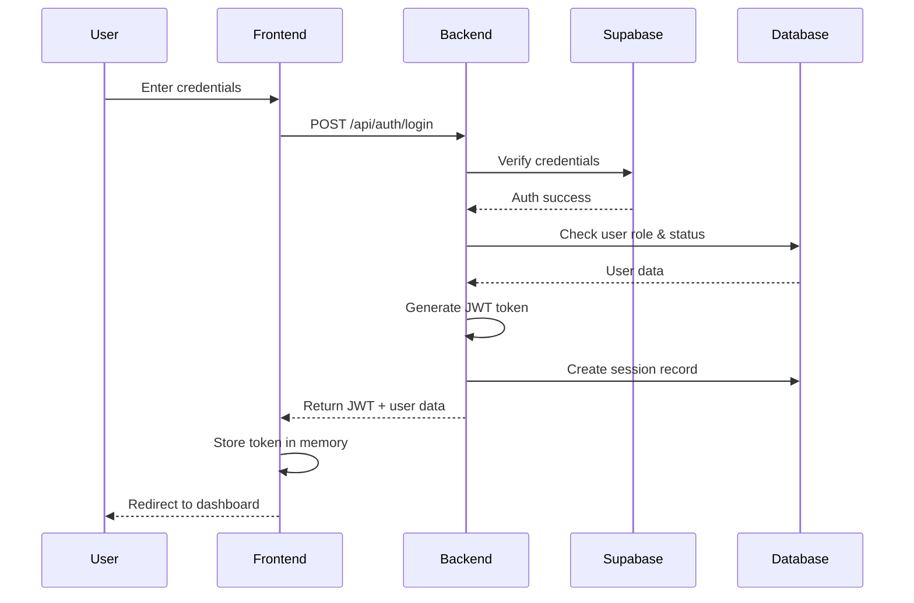

# System Architecture

Millenium Potters is built as a modern, scalable microfinance management platform using a client-server architecture with separate frontend and backend services.

## High-Level Architecture

```
┌─────────────────────────────────────────────────────────────┐
│                        Client Layer                          │
│  ┌────────────────────────────────────────────────────┐    │
│  │         Next.js 14 Frontend Application             │    │
│  │  (React 19, Tailwind CSS, Aceternity UI)            │    │
│  └────────────────────────────────────────────────────┘    │
└─────────────────────────────────────────────────────────────┘
                            ↕ HTTP/REST API
┌─────────────────────────────────────────────────────────────┐
│                      Application Layer                       │
│  ┌────────────────────────────────────────────────────┐    │
│  │       Node.js/Express Backend Server                │    │
│  │  (Prisma ORM, JWT Auth, Express Middleware)         │    │
│  └────────────────────────────────────────────────────┘    │
└─────────────────────────────────────────────────────────────┘
                            ↕
┌─────────────────────────────────────────────────────────────┐
│                      Data Layer                              │
│  ┌──────────────┐  ┌──────────────┐  ┌──────────────┐     │
│  │ CockroachDB  │  │   Supabase   │  │  Cloudinary  │     │
│  │  (Production)│  │    (Auth)    │  │  (Storage)   │     │
│  │ PostgreSQL   │  │              │  │              │     │
│  │    (Local)   │  │              │  │              │     │
│  └──────────────┘  └──────────────┘  └──────────────┘     │
└─────────────────────────────────────────────────────────────┘
```

## Technology Stack

<Tabs>
  <Tab title="Frontend">
    ### Frontend Technologies

    The client application is built with Next.js 14 and modern React patterns:

    | Technology | Version | Purpose |
    |------------|---------|----------|
    | **Next.js** | 16.0.10 | React framework with App Router |
    | **React** | 19.1.0 | UI library |
    | **TypeScript** | 5.x | Type safety |
    | **Tailwind CSS** | 4.x | Utility-first styling |
    | **Radix UI** | Various | Accessible component primitives |
    | **Framer Motion** | 12.25.0 | Animation library |
    | **Axios** | 1.11.0 | HTTP client |
    | **Shepherd.js** | 14.5.1 | Interactive user tours |
    | **Recharts** | 3.1.2 | Data visualization |
    | **date-fns** | 4.1.0 | Date manipulation |
    | **Sonner** | 2.0.7 | Toast notifications |

    See: `~/workspace/source/frontend/package.json:11-66`

    ### UI Component Libraries

    <CardGroup cols={3}>
      <Card title="Aceternity UI" icon="sparkles">
        Beautiful animated components for modern interfaces
      </Card>
      <Card title="Radix UI" icon="cube">
        Unstyled, accessible primitives for alerts, dialogs, dropdowns, etc.
      </Card>
      <Card title="Lucide Icons" icon="icons">
        Consistent icon library with 500+ icons
      </Card>
    </CardGroup>

    ### Key Features

    - **Server-Side Rendering (SSR)**: Fast initial page loads with Next.js App Router
    - **TypeScript**: Full type safety across the application
    - **Responsive Design**: Mobile-first design with Tailwind breakpoints
    - **Real-time Updates**: Automatic data refresh on mutations
    - **Error Monitoring**: Sentry integration for production error tracking
    - **Interactive Tours**: Shepherd.js guides for onboarding

    See: `~/workspace/source/frontend/package.json:27` (Sentry)
  </Tab>

  <Tab title="Backend">
    ### Backend Technologies

    The API server is built with Node.js and Express:

    | Technology | Version | Purpose |
    |------------|---------|----------|
    | **Node.js** | 18+ | Runtime environment |
    | **Express** | 4.18.2 | Web framework |
    | **Prisma** | 5.22.0 | ORM and database toolkit |
    | **TypeScript** | 5.3.3 | Type safety |
    | **bcryptjs** | 3.0.2 | Password hashing |
    | **jsonwebtoken** | 9.0.2 | JWT authentication |
    | **Supabase JS** | 2.94.0 | Auth integration |
    | **Cloudinary** | 2.8.0 | File storage |
    | **Nodemailer** | 7.0.6 | Email sending |
    | **Zod** | 3.22.4 | Schema validation |
    | **Helmet** | 8.1.0 | Security headers |

    See: `~/workspace/source/backend/package.json:28-52`

    ### API Architecture

    RESTful API with structured endpoints:

    ```
    /api/
    ├── auth/               # Authentication endpoints
    │   ├── login
    │   ├── logout
    │   ├── refresh
    │   └── password-reset
    ├── users/              # User management
    ├── unions/             # Union CRUD
    ├── union-members/      # Member management
    ├── loans/              # Loan operations
    ├── repayments/         # Payment recording
    ├── schedules/          # Repayment schedules
    ├── reports/            # Analytics and reports
    └── documents/          # File uploads
    ```

    ### Security Features

    <AccordionGroup>
      <Accordion title="Authentication & Authorization" icon="lock">
        - **JWT Tokens**: Secure token-based authentication
        - **Role-Based Access Control (RBAC)**: Three-tier permission system
        - **Session Management**: Track and revoke active sessions
        - **Password Hashing**: bcrypt with salt rounds
        - **Supabase Integration**: OAuth providers and magic links
      </Accordion>

      <Accordion title="Security Middleware" icon="shield">
        - **Helmet.js**: HTTP security headers (XSS, CSP, etc.)
        - **CORS**: Configured cross-origin resource sharing
        - **Rate Limiting**: Prevent brute force attacks
        - **Input Validation**: Zod schema validation on all inputs
        - **SQL Injection Prevention**: Prisma parameterized queries
      </Accordion>

      <Accordion title="Audit & Monitoring" icon="file-text">
        - **Audit Logs**: Track all critical actions with before/after snapshots
        - **Login History**: Monitor authentication attempts
        - **User Activity**: Track last login and activity timestamps
        - **Session Tracking**: JWT ID and IP address logging
      </Accordion>
    </AccordionGroup>

    See: `~/workspace/source/backend/prisma/schema.prisma:506-545`
  </Tab>

  <Tab title="Database">
    ### Database Schema

    Millenium Potters uses a relational database with a comprehensive schema:

    #### Core Entities

    <Steps>
      <Step title="Users" icon="user">
        User accounts with role-based permissions:

        ```prisma
        model User {
          id           String   @id @default(cuid())
          email        String   @unique
          passwordHash String
          role         Role     // ADMIN, SUPERVISOR, CREDIT_OFFICER
          isActive     Boolean  @default(true)
          
          firstName    String?
          lastName     String?
          phone        String?
          
          supervisorId String?  // Links officers to supervisors
          supervisor   User?    @relation("SupervisorToOfficers")
          
          unions       Union[]  // Credit Officer manages unions
          // ... relationships
        }
        ```

        See: `~/workspace/source/backend/prisma/schema.prisma:85-153`
      </Step>

      <Step title="Unions" icon="users">
        Organizational units for grouping members:

        ```prisma
        model Union {
          id              String  @id @default(cuid())
          name            String
          location        String?
          address         String?
          creditOfficerId String
          creditOfficer   User    @relation(fields: [creditOfficerId])
          
          unionMembers    UnionMember[]
          loans           Loan[]
        }
        ```

        Each union is managed by one Credit Officer and contains multiple members.

        See: `~/workspace/source/backend/prisma/schema.prisma:61-83`
      </Step>

      <Step title="Union Members" icon="user-group">
        Individual members who receive loans:

        ```prisma
        model UnionMember {
          id            String    @id @default(cuid())
          code          String?   @unique
          firstName     String
          lastName      String
          phone         String?
          email         String?
          address       String?
          dateOfBirth   DateTime?
          isVerified    Boolean   @default(true)
          
          unionId       String
          union         Union     @relation(fields: [unionId])
          
          documents     UnionMemberDocument[]
          loans         Loan[]
        }
        ```

        See: `~/workspace/source/backend/prisma/schema.prisma:156-197`
      </Step>

      <Step title="Loans" icon="money-bill">
        Loan applications and tracking:

        ```prisma
        model Loan {
          id              String      @id @default(cuid())
          loanNumber      String      @unique
          unionMemberId   String
          unionId         String
          loanTypeId      String?
          
          principalAmount Decimal     @db.Decimal(14, 2)
          termCount       Int
          termUnit        TermUnit    // DAY, WEEK, MONTH
          
          status          LoanStatus  @default(DRAFT)
          // DRAFT, PENDING_APPROVAL, APPROVED, ACTIVE, COMPLETED, etc.
          
          createdByUserId String
          assignedOfficerId String?
          
          scheduleItems   RepaymentScheduleItem[]
          repayments      Repayment[]
        }
        ```

        See: `~/workspace/source/backend/prisma/schema.prisma:225-280`
      </Step>

      <Step title="Repayments" icon="coins">
        Payment tracking and allocation:

        ```prisma
        model Repayment {
          id               String          @id @default(cuid())
          loanId           String
          receivedByUserId String
          
          amount           Decimal         @db.Decimal(14, 2)
          paidAt           DateTime
          method           RepaymentMethod // CASH, TRANSFER, POS, etc.
          reference        String?
          
          allocations      RepaymentAllocation[]
        }
        
        model RepaymentScheduleItem {
          id           String   @id @default(cuid())
          loanId       String
          sequence     Int
          dueDate      DateTime
          
          principalDue Decimal  @db.Decimal(14, 2)
          interestDue  Decimal  @db.Decimal(14, 2)
          totalDue     Decimal  @db.Decimal(14, 2)
          paidAmount   Decimal  @db.Decimal(14, 2)
          
          status       ScheduleStatus // PENDING, PAID, PARTIAL, OVERDUE
        }
        ```

        See: `~/workspace/source/backend/prisma/schema.prisma:282-350`
      </Step>
    </Steps>

    #### Database Providers

    <CardGroup cols={2}>
      <Card title="PostgreSQL 18" icon="database">
        **Local Development**
        - Fast local setup
        - Full SQL compatibility
        - Prisma migrations support
      </Card>
      <Card title="CockroachDB" icon="server">
        **Production**
        - Distributed SQL database
        - Automatic hourly backups (30-day retention)
        - Point-in-Time Recovery (PITR)
        - Serverless scaling
        - Online schema migrations
      </Card>
    </CardGroup>

    ```prisma
    datasource db {
      provider  = "cockroachdb"
      url       = env("DATABASE_URL")
      directUrl = env("DIRECT_URL")
      // Connection pooling: ~20-30 connections for 50-100 users
    }
    ```

    See: `~/workspace/source/backend/prisma/schema.prisma:8-15`

    ### Indexes and Performance

    Strategic indexes for query optimization:

    ```prisma
    // User indexes
    @@index([email])
    @@index([role])
    @@index([isActive])
    
    // Loan indexes
    @@index([status])
    @@index([loanNumber])
    @@index([unionMemberId])
    @@index([unionId])
    
    // Repayment indexes
    @@index([loanId, paidAt])
    @@index([receivedByUserId])
    ```
  </Tab>

  <Tab title="External Services">
    ### Third-Party Integrations

    <AccordionGroup>
      <Accordion title="Supabase Authentication" icon="key">
        **Purpose**: User authentication and OAuth

        **Features:**
        - Email/password authentication
        - OAuth providers (Google, GitHub, etc.)
        - Magic link authentication
        - JWT token generation
        - Password reset flows

        **Integration:**
        ```typescript
        import { createClient } from '@supabase/supabase-js'
        
        const supabase = createClient(
          process.env.SUPABASE_URL,
          process.env.SUPABASE_ANON_KEY
        )
        ```

        See: `~/workspace/source/backend/package.json:30` and `~/workspace/source/frontend/package.json:28`
      </Accordion>

      <Accordion title="Cloudinary Storage" icon="cloud">
        **Purpose**: Document and image storage

        **Features:**
        - Secure file uploads
        - Image optimization and transformation
        - CDN delivery
        - Backup storage for database exports

        **File Types:**
        - Member identity documents
        - Loan documents
        - Profile images
        - Database backup files

        **Integration:**
        ```typescript
        import cloudinary from 'cloudinary'
        
        cloudinary.v2.config({
          cloud_name: process.env.CLOUDINARY_CLOUD_NAME,
          api_key: process.env.CLOUDINARY_API_KEY,
          api_secret: process.env.CLOUDINARY_API_SECRET
        })
        ```

        See: `~/workspace/source/backend/package.json:38`
      </Accordion>

      <Accordion title="Email Service (SMTP)" icon="envelope">
        **Purpose**: Transactional emails

        **Use Cases:**
        - Password reset emails
        - Loan status notifications
        - Welcome emails
        - Payment confirmations

        **Configuration:**
        - Configurable SMTP settings in admin panel
        - Email templates with variable substitution
        - Template management in database

        **Integration:**
        ```typescript
        import nodemailer from 'nodemailer'
        
        const transporter = nodemailer.createTransport({
          host: process.env.SMTP_HOST,
          port: process.env.SMTP_PORT,
          auth: {
            user: process.env.SMTP_USER,
            pass: process.env.SMTP_PASS
          }
        })
        ```

        See: `~/workspace/source/backend/package.json:46` and `~/workspace/source/backend/prisma/schema.prisma:371-384`
      </Accordion>

      <Accordion title="Sentry Error Tracking" icon="bug">
        **Purpose**: Production error monitoring

        **Features:**
        - Real-time error tracking
        - Stack trace analysis
        - Performance monitoring
        - Release tracking

        **Integration:**
        - Frontend: Next.js integration
        - Backend: Express middleware
        - Source maps for debugging

        See: `~/workspace/source/frontend/package.json:27`
      </Accordion>
    </AccordionGroup>
  </Tab>
</Tabs>

## Authentication Flow



### Session Management

1. **Login**: User credentials verified via Supabase, JWT generated with user ID and role
2. **Token Storage**: JWT stored in HTTP-only cookie (production) or localStorage (development)
3. **Request Authorization**: Frontend includes JWT in Authorization header for API requests
4. **Token Validation**: Backend middleware verifies JWT signature and expiry
5. **Role Check**: Endpoint permissions checked against user role
6. **Session Tracking**: Active sessions tracked in database with JWT ID
7. **Logout**: Session revoked in database, token blacklisted

See: `~/workspace/source/backend/prisma/schema.prisma:506-522`

## Data Flow Examples

### Creating a Loan

<Steps>
  <Step title="Credit Officer creates draft">
    ```javascript
    POST /api/loans
    {
      unionMemberId: "...",
      principalAmount: 50000,
      termCount: 12,
      termUnit: "MONTH"
    }
    ```

    Backend:
    - Validates user has CREDIT_OFFICER role
    - Checks member belongs to officer's union
    - Creates loan with status DRAFT
    - Generates unique loan number
  </Step>

  <Step title="Officer submits for approval">
    ```javascript
    PATCH /api/loans/:id/submit
    ```

    Backend:
    - Updates status to PENDING_APPROVAL
    - Notifies supervisor via email
    - Creates audit log entry
  </Step>

  <Step title="Supervisor reviews and approves">
    ```javascript
    PATCH /api/loans/:id/approve
    {
      notes: "Approved after document review"
    }
    ```

    Backend:
    - Validates user has SUPERVISOR or ADMIN role
    - Updates status to APPROVED
    - Creates audit log entry
    - Notifies credit officer
  </Step>

  <Step title="Loan disbursement">
    ```javascript
    POST /api/loans/:id/disburse
    {
      disbursedAt: "2026-03-11",
      method: "TRANSFER",
      reference: "TXN123456"
    }
    ```

    Backend:
    - Updates status to ACTIVE
    - Generates repayment schedule
    - Creates schedule items in database
    - Calculates due dates based on term unit
  </Step>
</Steps>

### Recording a Repayment

<Steps>
  <Step title="Credit officer records payment">
    ```javascript
    POST /api/repayments
    {
      loanId: "...",
      amount: 5000,
      paidAt: "2026-03-11",
      method: "CASH"
    }
    ```
  </Step>

  <Step title="Backend allocates payment">
    - Find oldest unpaid/partial schedule item
    - Apply to interest first, then principal
    - Update schedule item status (PAID, PARTIAL, or PENDING)
    - Create RepaymentAllocation records
    - Update loan status if fully paid
  </Step>

  <Step title="Frontend updates UI">
    - Refresh repayment schedule
    - Update payment history
    - Recalculate outstanding balance
    - Show success notification
  </Step>
</Steps>

## Backup & Recovery

### Automated Backups

<CardGroup cols={2}>
  <Card title="CockroachDB Managed" icon="database">
    - Hourly automatic backups
    - 30-day retention period
    - Point-in-time recovery
    - Managed by CockroachDB service
  </Card>
  <Card title="Application-Level" icon="file-zipper">
    - Manual or scheduled exports
    - JSON/CSV format exports
    - Cloudinary storage
    - Configurable frequency and retention
  </Card>
</CardGroup>

### Backup Schedule Settings

```prisma
model BackupScheduleSettings {
  id               String    @id @default("default")
  frequency        String    @default("disabled")  // daily, weekly, monthly
  location         String    @default("cloud")      // local, cloud, both
  retentionDays    Int       @default(30)
  includeAuditLogs Boolean   @default(false)
  lastBackupAt     DateTime?
  nextBackupAt     DateTime?
}
```

See: `~/workspace/source/backend/prisma/schema.prisma:661-673`

## Deployment Architecture

### Production Deployment

```
┌─────────────────────────────────────────────┐
│              Vercel Edge Network             │
│  ┌────────────────────────────────────┐    │
│  │   Next.js Frontend (SSR/SSG)        │    │
│  └────────────────────────────────────┘    │
└─────────────────────────────────────────────┘
                    ↕
┌─────────────────────────────────────────────┐
│           Backend API Server                 │
│  (Render/Railway/AWS/DigitalOcean)          │
└─────────────────────────────────────────────┘
         ↕              ↕              ↕
┌──────────────┐ ┌──────────────┐ ┌──────────────┐
│ CockroachDB  │ │   Supabase   │ │  Cloudinary  │
│  Serverless  │ │    (Auth)    │ │  (Storage)   │
└──────────────┘ └──────────────┘ └──────────────┘
```

### Environment Configuration

<Tabs>
  <Tab title="Development">
    ```env
    NODE_ENV=development
    DATABASE_URL=postgresql://localhost:5432/millenium_local
    NEXT_PUBLIC_API_URL=http://localhost:5000/api
    ```
  </Tab>
  <Tab title="Production">
    ```env
    NODE_ENV=production
    DATABASE_URL=cockroachdb://...
    NEXT_PUBLIC_API_URL=https://api.millenium.com/api
    ```
  </Tab>
</Tabs>

### Maintenance Mode

Safe deployment with user lockout:

```prisma
model CompanySetting {
  maintenanceMode Boolean @default(false)
  // ... other settings
}
```

When enabled:
- All API requests return 503 Service Unavailable
- Frontend shows maintenance page
- Admin users can still access the system
- Scheduled for deployments and database migrations

See: `~/workspace/source/backend/prisma/schema.prisma:352-369`

## Performance Considerations

### Database Optimization

- **Connection Pooling**: 20-30 connections for 50-100 concurrent users
- **Strategic Indexes**: All foreign keys and frequently queried fields
- **Pagination**: Limit query results to prevent memory issues
- **Soft Deletes**: Use `deletedAt` field instead of hard deletes

### Frontend Optimization

- **Server-Side Rendering**: Fast initial page loads
- **Code Splitting**: Automatic with Next.js
- **Image Optimization**: Next.js Image component
- **Static Generation**: Pre-render pages when possible
- **API Response Caching**: React Query for client-side caching

### API Optimization

- **Rate Limiting**: Prevent abuse with express-rate-limit
- **Response Compression**: Gzip/Brotli compression
- **Query Optimization**: Prisma select for specific fields only
- **Batch Operations**: Reduce database round trips

See: `~/workspace/source/backend/package.json:42` (rate limiting)

## Scalability

### Horizontal Scaling

- **Stateless Backend**: Multiple API server instances
- **Load Balancing**: Distribute requests across servers
- **Database**: CockroachDB scales horizontally
- **CDN**: Cloudinary for global file delivery

### Vertical Scaling

- **Database**: Increase CockroachDB resources as needed
- **Server**: Scale up API server memory/CPU
- **Connection Pool**: Adjust based on concurrent users

<Note>
  The current architecture supports 50-100 concurrent users. For larger deployments, consider implementing Redis caching, message queues, and horizontal API scaling.
</Note>

## Security Best Practices

<CardGroup cols={2}>
  <Card title="Authentication" icon="key">
    - JWT tokens with expiration
    - HTTP-only cookies in production
    - Session tracking and revocation
    - Password reset with time-limited tokens
  </Card>
  <Card title="Authorization" icon="lock">
    - Role-based access control (RBAC)
    - Endpoint-level permission checks
    - Resource ownership validation
    - Supervisor-officer hierarchy enforcement
  </Card>
  <Card title="Data Protection" icon="shield">
    - Password hashing with bcrypt
    - Sensitive data encryption at rest
    - HTTPS enforced in production
    - Regular automated backups
  </Card>
  <Card title="Monitoring" icon="eye">
    - Audit logs for all critical actions
    - Login history tracking
    - Error monitoring with Sentry
    - Session activity monitoring
  </Card>
</CardGroup>

## What's Next?

<CardGroup cols={2}>
  <Card title="API Reference" icon="code" href="/api/auth/overview">
    Explore detailed API endpoint documentation
  </Card>
  <Card title="User Guide" icon="book" href="/guides/user-management">
    Learn how to use all platform features
  </Card>
  <Card title="Deployment Guide" icon="rocket" href="/deployment/prerequisites">
    Deploy to production with best practices
  </Card>
  <Card title="Development" icon="wrench" href="/deployment/prerequisites">
    Contribute to the codebase
  </Card>
</CardGroup>