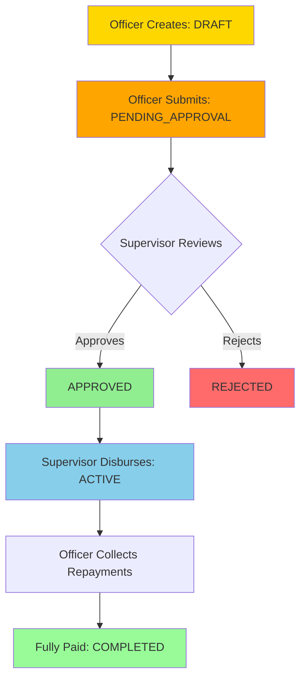

The **Credit Officer** role handles day-to-day field operations in the microfinance system. Credit Officers manage assigned unions, process loans, and maintain relationships with union members.

## Core Responsibilities

Credit Officers are responsible for:

- **Union Management**: Managing assigned unions and their members
- **Member Relations**: Registering members, maintaining profiles, building trust
- **Loan Processing**: Creating loan applications and preparing documentation
- **Repayment Collection**: Recording payments and following up on dues
- **Field Operations**: Visiting unions, conducting member meetings, assessing loan requests
- **Documentation**: Maintaining accurate records and uploading required documents

## Organizational Position

### Reporting Structure

Credit Officers report to Supervisors through the `supervisorId` field:

```prisma
model User {
  id             String  @id @default(cuid())
  email          String  @unique
  role           Role    // CREDIT_OFFICER
  
  // Links to supervising manager
  supervisorId   String?
  supervisor     User?   @relation("SupervisorToOfficers", fields: [supervisorId], references: [id])
  
  // Manages multiple unions
  unions         Union[] @relation("OfficerUnions")
  
  // ...
}
```

<Note>
  Every Credit Officer should have a `supervisorId` set. This establishes the reporting line and determines which supervisor can approve their loans.
</Note>

## Union Assignment

### Union Model Relationship

Credit Officers are assigned to unions via the `creditOfficerId` field:

```prisma
model Union {
  id              String  @id @default(cuid())
  name            String
  location        String?
  address         String?
  
  // Assigned Credit Officer
  creditOfficerId String
  creditOfficer   User    @relation("OfficerUnions", fields: [creditOfficerId], references: [id])
  
  // Union has many members
  unionMembers UnionMember[]
  
  // Union has many loans
  loans        Loan[]
  
  // ...
}
```

### Viewing Assigned Unions

Credit Officers can only view unions assigned to them:

```typescript
// GET /api/unions
// Returns unions where:
// - Union.creditOfficerId === currentUser.id (for CREDIT_OFFICER)
// - All unions (for ADMIN/SUPERVISOR)
```

### Multiple Union Management

A Credit Officer typically manages multiple unions:

```
Credit Officer: John Doe
  ├── Union: Downtown Potters (15 members)
  ├── Union: Market Street Group (22 members)
  ├── Union: West End Cooperative (18 members)
  └── Union: Riverside Artisans (12 members)
```

<Warning>
  Credit Officers cannot create, update, or delete unions. Only Admins and Supervisors have that authority. Union assignment is controlled by Admins.
</Warning>

## Member Management

### Union Member Model

Members belong to unions and are managed by the union's Credit Officer:

```prisma
model UnionMember {
  id            String    @id @default(cuid())
  code          String?   @unique
  firstName     String
  lastName      String
  phone         String?
  email         String?
  
  // Belongs to a Union
  unionId          String
  union            Union   @relation(fields: [unionId], references: [id])
  
  // Current officer (redundant but kept for history)
  currentOfficer   User?   @relation("CurrentOfficer", fields: [currentOfficerId], references: [id])
  currentOfficerId String?
  
  // Profile and verification
  isVerified    Boolean   @default(true)
  profileImage  String?
  
  // Personal details
  dateOfBirth   DateTime?
  gender        String?
  address       String?
  city          String?
  profession    String?
  
  // Relations
  loans         Loan[]
  documents     UnionMemberDocument[]
  
  // ...
}
```

### Adding New Members

Credit Officers can add members to their assigned unions:

```typescript
// POST /api/union-members
{
  "firstName": "Mary",
  "lastName": "Johnson",
  "phone": "+234-XXX-XXX-XXXX",
  "email": "mary.j@example.com",
  "unionId": "clx...",  // Must be assigned to current officer
  "dateOfBirth": "1985-05-15",
  "gender": "Female",
  "address": "45 Market Road",
  "city": "Lagos",
  "profession": "Potter",
  "isVerified": true
}
```

<Note>
  Members must be verified (`isVerified: true`) before they can receive loans. This is typically done after document verification.
</Note>

### Viewing Members

Credit Officers can only see members from their assigned unions:

```typescript
// GET /api/union-members
// Returns members where:
// - UnionMember.unionId IN (officer's union IDs)
```

### Updating Member Information

Credit Officers can update member profiles:

```typescript
// PUT /api/union-members/:id
{
  "phone": "+234-XXX-XXX-XXXX",
  "address": "New address after relocation",
  "profession": "Potter and Retailer"
}
```

### Member Documents

Credit Officers upload and manage member documents:

```prisma
model UnionMemberDocument {
  id                String       @id @default(cuid())
  unionMemberId     String
  unionMember       UnionMember  @relation(fields: [unionMemberId], references: [id])
  
  documentTypeId    String
  documentType      DocumentType @relation(fields: [documentTypeId], references: [id])
  
  fileUrl           String
  verified          Boolean      @default(false)
  
  uploadedByUserId  String
  uploadedBy        User         @relation("UnionMemberDocUploadedBy", fields: [uploadedByUserId], references: [id])
  
  // ...
}
```

## Loan Processing

### Creating Loan Applications

Credit Officers create loan applications for members in their unions:

```typescript
// POST /api/loans
// loan.routes.ts:24-30
// Requires: requireStaff (ADMIN, SUPERVISOR, CREDIT_OFFICER)
{
  "unionMemberId": "clx...",  // Must be from officer's union
  "unionId": "clx...",        // Officer's assigned union
  "loanTypeId": "clx...",
  "principalAmount": 50000.00,
  "termCount": 6,
  "termUnit": "MONTH",
  "startDate": "2024-03-01T00:00:00Z",
  "processingFeeAmount": 2500.00,
  "penaltyFeePerDayAmount": 50.00,
  "notes": "Working capital for pottery expansion"
}
```

### Loan Model Structure

```prisma
model Loan {
  id            String      @id @default(cuid())
  loanNumber    String      @unique
  
  // Member and Union
  unionMemberId String
  unionMember   UnionMember @relation(fields: [unionMemberId], references: [id])
  unionId       String
  union         Union       @relation(fields: [unionId], references: [id])
  
  // Loan details
  loanTypeId      String?
  loanType        LoanType? @relation(fields: [loanTypeId], references: [id])
  principalAmount Decimal   @db.Decimal(14, 2)
  termCount       Int
  termUnit        TermUnit
  
  // Status tracking
  status LoanStatus @default(DRAFT)
  
  // Creation and assignment
  createdByUserId   String
  createdByUser     User      @relation("CreatedLoans", fields: [createdByUserId], references: [id])
  assignedOfficerId String?
  assignedOfficer   User?     @relation("AssignedLoans", fields: [assignedOfficerId], references: [id])
  
  // Relations
  scheduleItems RepaymentScheduleItem[]
  repayments    Repayment[]
  documents     LoanDocument[]
  
  // ...
}
```

### Loan Status Workflow

Credit Officers participate in this workflow:



### Loan Status Values

```prisma
enum LoanStatus {
  DRAFT              // Officer is still editing
  PENDING_APPROVAL   // Submitted to supervisor
  APPROVED           // Supervisor approved
  ACTIVE             // Disbursed and being repaid
  COMPLETED          // Fully repaid
  DEFAULTED          // Member failed to repay
  WRITTEN_OFF        // Uncollectible
  CANCELED           // Application canceled
}
```

### Viewing Loans

Credit Officers can only see loans they created or are assigned to:

```typescript
// GET /api/loans
// Returns loans where:
// - Loan.createdByUserId === currentUser.id, OR
// - Loan.assignedOfficerId === currentUser.id
```

### Updating Loan Details

Credit Officers can update loans in DRAFT status:

```typescript
// PUT /api/loans/:id
// loan.routes.ts:57-63
{
  "principalAmount": 60000.00,  // Increased amount
  "notes": "Updated: Member requested additional capital for new kiln"
}
```

<Warning>
  Once a loan is submitted for approval (PENDING_APPROVAL), Credit Officers cannot modify loan terms. Only status changes by supervisors are allowed.
</Warning>

### Loan Documents

Credit Officers upload supporting documents:

```prisma
model LoanDocument {
  id               String       @id @default(cuid())
  loanId           String
  loan             Loan         @relation(fields: [loanId], references: [id])
  documentTypeId   String
  documentType     DocumentType @relation(fields: [documentTypeId], references: [id])
  
  fileUrl          String
  verified         Boolean      @default(false)
  
  uploadedByUserId String
  uploadedBy       User         @relation("LoanDocUploadedBy", fields: [uploadedByUserId], references: [id])
  
  // ...
}
```

## Repayment Collection

### Recording Repayments

Credit Officers record payments from members:

```typescript
// POST /api/repayments
{
  "loanId": "clx...",
  "amount": 10000.00,
  "paidAt": "2024-03-15T14:30:00Z",
  "method": "CASH",
  "reference": "RCP-2024-0315-001",
  "notes": "Collected at weekly union meeting"
}
```

### Repayment Model

```prisma
model Repayment {
  id               String @id @default(cuid())
  loanId           String
  loan             Loan   @relation(fields: [loanId], references: [id])
  
  receivedByUserId String
  receivedBy       User   @relation(fields: [receivedByUserId], references: [id])
  
  amount       Decimal         @db.Decimal(14, 2)
  currencyCode String          @default("NGN")
  paidAt       DateTime
  method       RepaymentMethod
  reference    String?
  notes        String?
  
  allocations RepaymentAllocation[]
  
  // ...
}
```

### Payment Methods

```prisma
enum RepaymentMethod {
  CASH      // Cash collection
  TRANSFER  // Bank transfer
  POS       // POS machine
  MOBILE    // Mobile money
  USSD      // USSD payment
  OTHER     // Other methods
}
```

### Repayment Schedule

Credit Officers monitor upcoming payments:

```typescript
// GET /api/loans/:id/schedule
// Returns RepaymentScheduleItem[] with:
```

```prisma
model RepaymentScheduleItem {
  id       String @id @default(cuid())
  loanId   String
  loan     Loan   @relation(fields: [loanId], references: [id])
  
  sequence Int      // 1, 2, 3...
  dueDate  DateTime
  
  principalDue Decimal @db.Decimal(14, 2)
  interestDue  Decimal @default(0) @db.Decimal(14, 2)
  feeDue       Decimal @default(0) @db.Decimal(14, 2)
  totalDue     Decimal @db.Decimal(14, 2)
  paidAmount   Decimal @default(0) @db.Decimal(14, 2)
  
  status   ScheduleStatus @default(PENDING)
  closedAt DateTime?
  
  // ...
}
```

### Schedule Status

```prisma
enum ScheduleStatus {
  PENDING   // Not yet paid
  PARTIAL   // Partially paid
  PAID      // Fully paid
  OVERDUE   // Past due date
}
```

## Data Access Restrictions

### What Credit Officers Can Access

| Entity | Access Scope |
|--------|-------------|
| **Unions** | Only unions where `Union.creditOfficerId === currentUser.id` |
| **Members** | Only members belonging to assigned unions |
| **Loans** | Only loans created by or assigned to the officer |
| **Repayments** | Only repayments for loans they manage |
| **Documents** | Only documents for their members and loans |

### What Credit Officers Cannot Access

<Warning>
  Credit Officers cannot:
  - View other officers' unions, members, or loans
  - Access supervisor reports or analytics
  - See system-wide statistics
  - Approve or reject loans
  - Disburse loans
  - Assign loans to other officers
  - Create or manage users
  - Access system configuration
</Warning>

## Credit Officer Permissions Summary

### ✅ Can Do

- View assigned unions
- Add and manage members in assigned unions
- Upload member documents
- Create loan applications (DRAFT status)
- Submit loans for approval (PENDING_APPROVAL)
- Update loans in DRAFT status
- View loans they created or are assigned to
- Upload loan documents
- Record repayments for their loans
- View repayment schedules
- Update own profile

### ❌ Cannot Do

- Create, update, or delete unions
- View other officers' data
- Approve or reject loans
- Disburse loans
- Assign loans to other officers
- Delete users or members
- Regenerate loan schedules
- Access supervisor reports
- View system-wide analytics
- Manage system settings
- Create other users

## Best Practices

<AccordionGroup>
  <Accordion title="Regular Union Visits">
    Visit each union weekly or bi-weekly. Face-to-face interaction builds trust and helps identify members who may need support.
  </Accordion>
  
  <Accordion title="Accurate Documentation">
    Always upload required documents before submitting loans for approval. Missing documents delay approvals and frustrate members.
  </Accordion>
  
  <Accordion title="Timely Repayment Collection">
    Record repayments immediately after collection. Don't wait until end of day. This keeps data current for supervisors.
  </Accordion>
  
  <Accordion title="Proactive Follow-up">
    Monitor repayment schedules and follow up with members 2-3 days before due dates. Prevention is better than collection.
  </Accordion>
  
  <Accordion title="Member Relationships">
    Build strong relationships with union members. Understanding their businesses helps you prepare better loan applications.
  </Accordion>
  
  <Accordion title="Clear Loan Notes">
    Write detailed notes in loan applications. Explain the purpose, member's business, and why you believe they'll repay. This helps supervisors make informed decisions.
  </Accordion>
</AccordionGroup>

## Common Workflows

### New Member Onboarding

1. Meet member at union meeting
2. Collect member information and documents
3. Create member profile in system
4. Upload documents (ID, photo, etc.)
5. Mark member as verified
6. Member can now apply for loans

### Loan Application Process

1. Assess member's loan request
2. Create loan in DRAFT status
3. Upload supporting documents
4. Review calculations and schedule
5. Submit for approval (PENDING_APPROVAL)
6. Wait for supervisor approval
7. Once approved and disbursed, begin collections

### Weekly Collections Routine

1. Review upcoming due dates for the week
2. Visit unions on scheduled collection days
3. Collect payments from members
4. Record each repayment immediately
5. Update members on their loan balance
6. Follow up on any overdue payments

## Related Resources

<CardGroup cols={2}>
  <Card title="Admin Role" icon="crown" href="/roles/admin">
    Learn about administrator capabilities
  </Card>
  <Card title="Supervisor Role" icon="user-tie" href="/roles/supervisor">
    Understand your supervisor's responsibilities and approval process
  </Card>
</CardGroup>