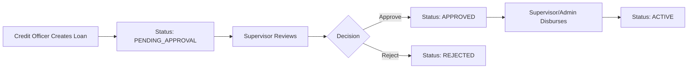

The **Supervisor** role serves as middle management in the organizational hierarchy. Supervisors oversee Credit Officers, approve loan applications, and monitor team performance.

## Core Responsibilities

Supervisors are responsible for:

- **Team Management**: Overseeing assigned Credit Officers
- **Loan Approval**: Reviewing and approving/rejecting loan applications
- **Performance Monitoring**: Tracking officer performance and portfolio health
- **Territory Oversight**: Managing operations across supervised unions
- **Reporting**: Generating reports on team activities and metrics

## Supervisor-Officer Hierarchy

### Data Model Relationship

The supervisor-officer relationship is established through the `supervisorId` field:

```prisma
model User {
  id             String  @id @default(cuid())
  email          String  @unique
  role           Role
  
  // Credit Officer links to their Supervisor
  supervisorId   String?
  supervisor     User?   @relation("SupervisorToOfficers", fields: [supervisorId], references: [id])
  
  // Supervisor has many Credit Officers
  creditOfficers User[]  @relation("SupervisorToOfficers")
  
  // ...
}
```

### Relationship Setup

When creating a Credit Officer, admins or supervisors must set the `supervisorId`:

```typescript
// POST /api/users
{
  "email": "officer@example.com",
  "firstName": "Jane",
  "lastName": "Smith",
  "role": "CREDIT_OFFICER",
  "supervisorId": "clx...",  // Links to supervisor
  "password": "securePassword123"
}
```

<Note>
  A Supervisor can have multiple Credit Officers, but each Credit Officer reports to only one Supervisor.
</Note>

## User Management

### Creating Credit Officers

Supervisors can create Credit Officer accounts:

```typescript
// POST /api/users
// user.routes.ts:58-63
// Requires: requireAdminOrBranchManager middleware
```

When a supervisor creates a user:
1. The new user's role must be `CREDIT_OFFICER`
2. The `supervisorId` is automatically set to the creating supervisor
3. The new officer inherits territorial assignments

### Viewing Team Members

Supervisors can view all Credit Officers under their supervision:

```typescript
// GET /api/supervisor-reports/officers
// supervisor-reports.routes.ts:55-58
// Returns list of Credit Officers where supervisorId matches current user
```

<Warning>
  Supervisors cannot create other supervisors or admin accounts. They can only create Credit Officers.
</Warning>

## Loan Approval Authority

### Approval Workflow

Supervisors are the gatekeepers for loan disbursement:



### Approving Loans

Supervisors can approve loans using the status update endpoint:

```typescript
// PUT /api/loans/:id/status
// loan.routes.ts:65-71
// Requires: requireBranchManager (includes ADMIN and SUPERVISOR)
{
  "status": "APPROVED",
  "notes": "Reviewed and approved. Member has good repayment history."
}
```

### Rejecting Loans

Supervisors can reject applications with reasons:

```typescript
// PUT /api/loans/:id/status
{
  "status": "REJECTED",
  "notes": "Insufficient documentation. Request member to provide updated employment letter."
}
```

<Note>
  When rejecting loans, always provide clear notes explaining the reason. This helps Credit Officers understand what's needed.
</Note>

### Loan Disbursement

After approval, supervisors can disburse loans:

```typescript
// POST /api/loans/:id/disburse
// loan.routes.ts:73-79
// Requires: requireBranchManager middleware
{
  "disbursementDate": "2024-03-15T10:00:00Z",
  "disbursementMethod": "TRANSFER",
  "reference": "TXN123456",
  "notes": "Transferred to member's bank account"
}
```

### Loan Assignment

Supervisors can assign or reassign loans to officers:

```typescript
// POST /api/loans/:id/assign
// loan.routes.ts:81-87
{
  "assignedOfficerId": "clx...",
  "reason": "Reassigning to officer with capacity in this area"
}
```

## Union Management

### Creating Unions

Supervisors can create new unions:

```typescript
// POST /api/unions
// union.routes.ts:14-19
// Requires: requireRole(Role.ADMIN, Role.SUPERVISOR)
{
  "name": "Downtown Potters Union",
  "location": "Central District",
  "address": "123 Main Street",
  "creditOfficerId": "clx..."  // Must be a supervised officer
}
```

### Viewing Supervised Unions

Supervisors see all unions managed by their Credit Officers:

```typescript
// GET /api/unions
// Returns unions where:
// - Union.creditOfficerId IN (supervised officer IDs)
// - OR user is ADMIN/SUPERVISOR (see all)
```

<Warning>
  Supervisors cannot update or delete unions. Only admins have that authority. This prevents accidental territorial changes.
</Warning>

## Reporting & Analytics

### Supervisor Dashboard

Supervisors have access to a dedicated reporting dashboard:

```typescript
// GET /api/supervisor-reports/dashboard
// supervisor-reports.routes.ts:24-28
// Requires: requireRoles(["SUPERVISOR", "ADMIN"])
```

The dashboard includes:
- Total Credit Officers supervised
- Total unions in territory
- Total members across all supervised unions
- Loan portfolio summary (active, completed, defaulted)
- Disbursement and repayment totals
- Collection rate percentage

### Report Generation

Supervisors can generate detailed performance reports:

```typescript
// POST /api/supervisor-reports/generate
// supervisor-reports.routes.ts:31-34
{
  "reportType": "MONTHLY",
  "periodStart": "2024-03-01T00:00:00Z",
  "periodEnd": "2024-03-31T23:59:59Z",
  "title": "March 2024 Territory Report"
}
```

Report data is stored in the `ReportSession` model:

```prisma
model ReportSession {
  id           String @id @default(cuid())
  supervisorId String
  supervisor   User   @relation("SupervisorReports", fields: [supervisorId], references: [id])
  
  reportType  ReportType @default(CUSTOM)
  title       String?
  periodStart DateTime
  periodEnd   DateTime
  
  // Cached metrics
  totalOfficers  Int @default(0)
  totalUnions    Int @default(0)
  totalMembers   Int @default(0)
  totalLoans     Int @default(0)
  activeLoans    Int @default(0)
  completedLoans Int @default(0)
  defaultedLoans Int @default(0)
  
  totalDisbursed   Decimal @default(0) @db.Decimal(14, 2)
  totalRepaid      Decimal @default(0) @db.Decimal(14, 2)
  totalOutstanding Decimal @default(0) @db.Decimal(14, 2)
  collectionRate   Decimal @default(0) @db.Decimal(5, 2)
  
  // Full snapshot
  reportData     Json?
  officerMetrics Json?
  
  generatedAt DateTime @default(now())
}
```

### Report Types

Available report types:

```prisma
enum ReportType {
  DAILY
  WEEKLY
  MONTHLY
  QUARTERLY
  CUSTOM
}
```

### Officer Performance Metrics

Reports include per-officer breakdowns:

```json
{
  "officerMetrics": [
    {
      "officerId": "clx...",
      "officerName": "Jane Smith",
      "unionsManaged": 5,
      "totalMembers": 120,
      "loansCreated": 45,
      "totalDisbursed": 4500000.00,
      "totalRepaid": 2800000.00,
      "collectionRate": 92.5,
      "overdueLoans": 3
    }
  ]
}
```

### Viewing Past Reports

Supervisors can retrieve previously generated reports:

```typescript
// GET /api/supervisor-reports/sessions
// Returns all ReportSession records for the current supervisor

// GET /api/supervisor-reports/sessions/:id
// Returns specific report with full data
```

## Data Access Scope

### What Supervisors Can See

Supervisors have visibility into:

| Entity | Access Scope |
|--------|-------------|
| **Users** | All Credit Officers where `supervisorId` matches current user |
| **Unions** | All unions managed by supervised Credit Officers |
| **Members** | All members belonging to supervised unions |
| **Loans** | All loans created by or assigned to supervised officers |
| **Repayments** | All repayments for loans in supervised territory |

### What Supervisors Cannot See

<Warning>
  Supervisors cannot access:
  - Other supervisors' territories
  - System settings and configuration
  - Admin-only reports
  - Audit logs for admin actions
</Warning>

## Supervisor Permissions Summary

### ✅ Can Do

- Create Credit Officer accounts
- Create unions and assign them to officers
- View all data in supervised territory
- Approve or reject loan applications
- Disburse approved loans
- Assign/reassign loans to officers
- Generate supervisor reports
- View officer performance metrics
- Record repayments
- Manage union members in territory

### ❌ Cannot Do

- Create admin or supervisor accounts
- Update or delete unions
- Reassign unions to different officers
- Delete users
- Reset user passwords
- Access system configuration
- Manage loan types
- Enable maintenance mode
- Perform backup/restore operations
- View other supervisors' data
- Regenerate loan schedules

## Best Practices

<AccordionGroup>
  <Accordion title="Regular Territory Reviews">
    Review your territory's performance weekly. Look for:
    - Officers with high overdue rates
    - Unions with unusual activity
    - Loans pending approval for too long
  </Accordion>
  
  <Accordion title="Timely Loan Approvals">
    Review loan applications within 24-48 hours. Delays impact member satisfaction and officer performance.
  </Accordion>
  
  <Accordion title="Clear Rejection Reasons">
    When rejecting loans, provide specific, actionable feedback. This helps officers improve future applications.
  </Accordion>
  
  <Accordion title="Officer Development">
    Use report metrics to identify training needs. Officers with low collection rates may need support or coaching.
  </Accordion>
  
  <Accordion title="Territory Balance">
    Monitor union and member distribution across your officers. Avoid overloading any single officer.
  </Accordion>
</AccordionGroup>

## Related Resources

<CardGroup cols={2}>
  <Card title="Admin Role" icon="crown" href="/roles/admin">
    Understand administrator capabilities and system management
  </Card>
  <Card title="Credit Officer Role" icon="briefcase" href="/roles/credit-officer">
    Learn about field operations and officer responsibilities
  </Card>
</CardGroup>